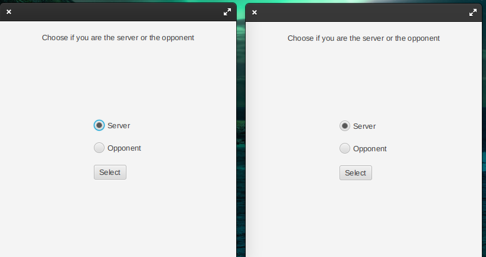
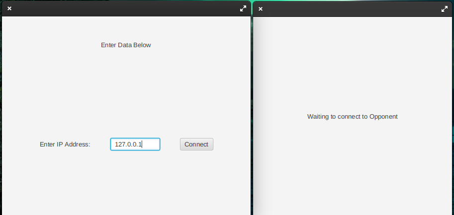
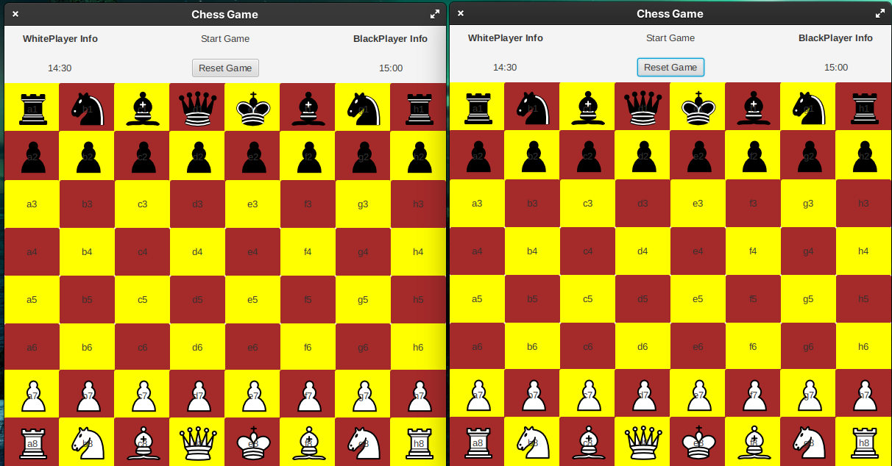
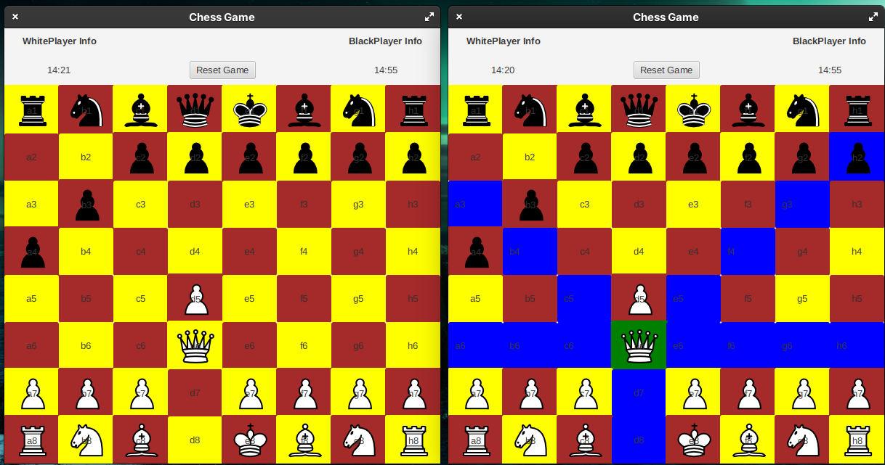
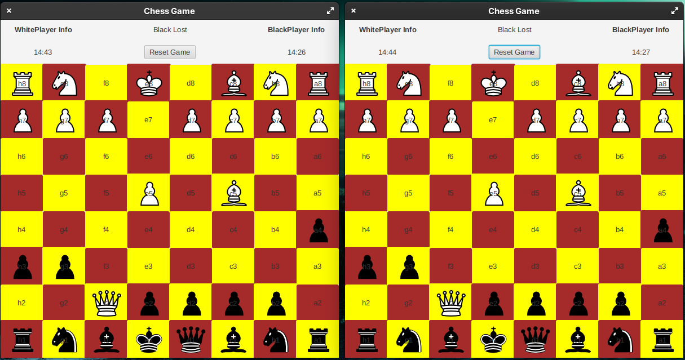

# Chess

GUI Multiplayer Chess over network with timer and check mate capabilities like regular chess games.

## How To Run

1. Use SDK `corretto-1.8 Amazon`.
2. Run GUI.java.

## How to Play

1. First, each player runs the game.

2. One player should choose server and others should be client. The client must type the servers' IP. For now, server is local Host `127.0.0.1` and press `connect`.

3. Then, play!

4. Yay, Checkmate!

